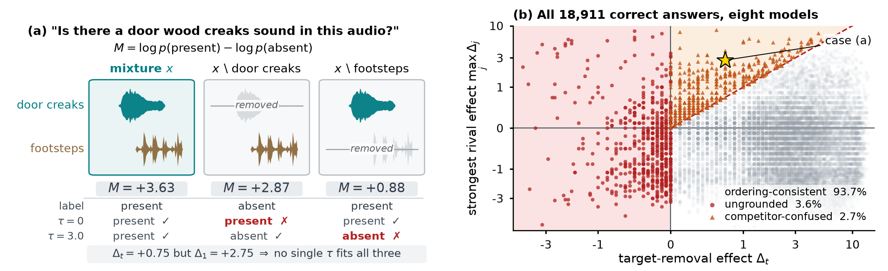
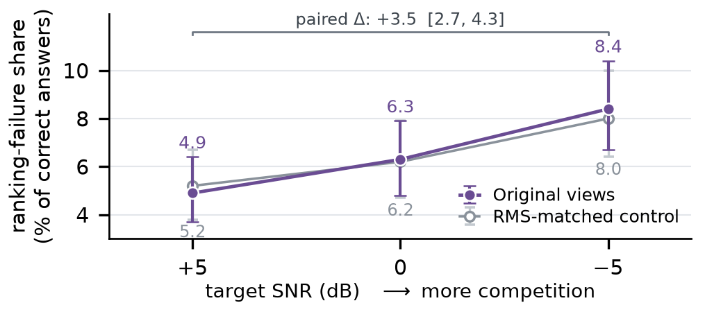

<h1 align="center">TRACE</h1>
<h3 align="center">Right Answers, Inconsistent Evidence: Source-Level Counterfactual Auditing of Audio-Language Models</h3>

<p align="center">
  <a href="#citation"></a>
  
  
  
  <br/>
  
  
  
</p>

<p align="center">
  <a href="#news">News</a> |
  <a href="#overview">Overview</a> |
  <a href="#method">Method</a> |
  <a href="#quick-start">Quick Start</a> |
  <a href="#result-snapshot">Results</a> |
  <a href="#repo-layout">Repo Layout</a> |
  <a href="#reproducibility">Reproducibility</a> |
  <a href="#citation">Citation</a>
</p>

---

## News

- **2026-09-20** - Public release: eight-model scores, seven frozen audio panels, checksummed sources, and the CPU reproduction pipeline.
- **2026-09-23** - README restructured; all reproduction commands re-run and re-verified.

---

## Overview

A large audio-language model (LALM) can answer *"is a cat present?"* about a mixture correctly, and its confidence can even drop when the cat is removed — yet neither observation shows that the model can tell the cat's presence from its absence.

TRACE audits the **consistency of the counterfactual evidence** behind an answer. It deletes the queried source and each rival in turn, then asks whether every view still containing that sound outscores the view with it removed. A correct answer that fails this ordering rests on inconsistent evidence.

Across eight models and 3,456 mixture conditions per model:

- **18,911** correct mixture answers out of **27,648** evaluations.
- **1,184 / 18,911 = 6.3%** ranking failures (95% source-tuple bootstrap CI: 4.9–7.8%).
- **681** ungrounded and **503** competitor-confused answers.
- A target-only score check misses **42.5%** of these failures.
- On 5,466 common-correct units, failures increase from **4.9% to 8.4%** as target SNR falls from +5 to −5 dB.

> Project-authored code, metadata and scores are released under the MIT license: see [LICENSE](LICENSE). ESC-50-derived audio keeps its upstream noncommercial terms and is **not** covered by MIT; see [Licensing](#licensing). No model weights are included.

---

## Method

<p align="center">
  
</p>
<p align="center">
  <em>
    Figure 1: Overview of TRACE. (a) A mixture (door wood creaks + footsteps; 0 dB, partial overlap). The target-only check passes, yet removing the rival lowers the score further, so no shared threshold fits all views. (b) All 18,911 correct answers by target-removal effect Δ<sub>t</sub> and strongest rival effect max<sub>j</sub> Δ<sub>j</sub> (symlog): Δ<sub>t</sub> ≤ 0 ungrounded, on or above the dashed line competitor-confused, the rest ordering-consistent. Star: case in (a).
  </em>
</p>

Let `m_full` be the present-vs-absent margin on the original mixture, `m_target_removed` the margin after deleting the queried source, and `m_rivals` the margins after deleting each competing source:

```text
H = min(m_full, min(m_rivals)) - m_target_removed
correct mixture answer: m_full > 0
ranking failure:        m_full > 0 and H <= 0
```

`H > 0` means one shared local threshold separates every deletion view of that unit — the score-level ordering property TRACE audits and the quantity reported in Tables 1–4. A ranking failure splits into two interpretable sub-cases:

- **ungrounded** (`Δ_t ≤ 0`): the model reports the target with equal or greater confidence *after* the target is deleted, so even the target-only check fails.
- **competitor-confused** (`Δ_t > 0` but `max_j Δ_j ≥ Δ_t`): the target-only check passes while a target-absent view outscores a target-present view.

These labels describe score behavior, not identified internal mechanisms. Directory and module names such as `experiments/qsaec/` are historical code identifiers; the metric implemented and reported throughout is `H`.

### Dataset and Evaluation Panels

All audio is derived from [ESC-50](https://github.com/karoldvl/ESC-50). The main panel uses 192 source recordings spanning 49 categories, arranged into 64 three-source tuples and 192 queried target roles. Per target role there are three SNR levels, two overlap settings and three distractor selections — rival 1 alone, rival 2 alone, or both — giving `192 × 3 × 2 × 3 = 3,456` conditions per model.

| Panel | Conditions/model | Views/model | Models | Purpose |
| --- | ---: | ---: | ---: | --- |
| `baseline` | 3,456 | 11,520 | 8 | Main source-removal audit |
| `global_rms` | 3,456 | 11,520 | 8 | Loudness-matched removal control |
| `repair` | 2,880 | 11,520 | 3 | Five re-pairings of each of 192 target roles |
| `subst` | 2,880 | 9,600 | 8 | 160 replacement recordings over 56 Q1/Q5 roles |
| `absent` | 512 | 512 | 8 | Four wordings × two mappings on 64 absent-event mixtures |
| `prompt` | 1,536 | 6,144 | 8 | Paired prompt/mapping checks |
| `fixed` | 192 | 768 | 8 | Fixed-mixture query-swap reference |

There are **51,584 view entries across the seven audio panels** and **355,072 released model-view scores**; fixed/prompt/absent panels reuse audio, so a view entry corresponds to one condition in the audit rather than to a distinct waveform.

The three re-pairing models are Qwen2.5-Omni-7B, Qwen3-Omni-30B and Step-Audio 2 Mini. Target substitution covers 42 original tuples and 19 categories.

`data/audio_sources/` contains 192 single-stem files, 160 substitution clips and 256 reusable fixed-mixture views. `INDEX.jsonl` records SHA-256 digests and ESC-50 source attribution. Rendered main/stress mixtures are 4 s; source mixing uses 44.1 kHz PCM16, while adapters handle model input resampling. Source gains, offsets and clipping/normalization factors are frozen in the manifests.

See [data/README.md](data/README.md) for schemas and provenance, and [analysis/README.md](analysis/README.md) for the expected statistics and reproduction scope.

---

## Quick Start

### Prerequisites

- Python `>=3.10`
- No GPU required to reproduce every paper number
- GPU environments only for fresh inference (see [Re-run Model Inference](#4-re-run-model-inference))

### 1. Install

```bash
python3 -m venv .venv
source .venv/bin/activate
python -m pip install -r requirements/analysis.txt
```

### 2. Reproduce the Paper

```bash
# Validate 51 raw-score files and reproduce the exact main counts.
python scripts/audit_scores.py

# Run metric boundary tests.
python -m unittest discover -s tests -v

# Validate checksums, source/analysis consistency, syntax and release hygiene.
python scripts/verify_release.py

# Recompute the target-substitution sufficient statistics from 23,040 paired units.
python scripts/aggregate_subst.py

# Recompute Tables 1-4 and all included paper-facing statistics.
python analysis/run_all.py

# Also rebuild Figure 1 (Matplotlib, no LaTeX installation needed).
python analysis/run_all.py --figures
```

Results are written to `analysis/generated/`; step logs are written to `analysis/logs/`. These are generated working directories and are excluded from Git. The scripts run entirely on local frozen inputs and never contact the original experiment server: `analysis/run_all.py` rebuilds every paper-facing statistic in about 15 seconds on a laptop.

### 3. Rebuild Audio

```bash
# Smoke test all seven panels in memory.
python scripts/render_audio.py --check-only --limit 4

# Full bit-exact verification without writing generated audio.
python scripts/render_audio.py --check-only

# Render baseline for inference.
python scripts/render_audio.py --panel baseline --output-dir rendered
```

The final command creates `rendered/baseline/stress_manifest.jsonl` and its audio files. Every view must match its frozen SHA-256 digest. Nonempty panel output directories are refused; `--verify-existing` explicitly requests verification/resumption instead of silent replacement. Full rendering requires substantially more storage than the small released source pool.

### 4. Re-run Model Inference

The adapters are the actual frozen execution versions; checkpoints must be obtained separately under their upstream terms. Use **separate environments** for core models, Audio Flamingo 3, and MiMo. Do not install all Transformers requirement files together.

| Paper model | Adapter argument | Runtime |
| --- | --- | --- |
| Qwen2-Audio-7B | `qwen2_audio` | core |
| Qwen2.5-Omni-3B / 7B | `qwen` | core |
| Qwen2.5-Omni-7B + AHA | `qwen` + `--lora-path` | core + PEFT |
| Qwen3-Omni-30B | `qwen3_omni` | core |
| Step-Audio 2 Mini | `step_audio2` | core |
| MiMo-Audio-7B | `mimo_audio` + `--tokenizer-path` | MiMo upstream source |
| Audio Flamingo 3 | `audio_flamingo_3_hf` | AF3 HF |

Example, after installing PyTorch compatible with your CUDA driver and `requirements/core.txt` in a dedicated environment:

```bash
CUDA_VISIBLE_DEVICES=0 python -m experiments.qsaec.run_stress \
  --manifest rendered/baseline/stress_manifest.jsonl \
  --model /path/to/Qwen2-Audio-7B-Instruct \
  --model-id qwen2_audio_7b --adapter qwen2_audio \
  --device cuda --dtype bfloat16 \
  --output outputs/qwen2_audio_7b.jsonl
```

Use `--shard-index 0 --num-shards 8` for one of eight **condition-level** shards; run indices 0–7 with distinct output paths. The direct inference entry point writes a fresh output file: use a new path to avoid replacing previous scores. A/B labels stay fixed within each query's deletion views. Scores come from answer-token probabilities, not parsed free-form generations.

The core and AF3 environments used PyTorch `2.10.0+cu129`, Transformers `4.57.6` / `5.0.0rc1`, respectively. MiMo used Transformers `4.49.0` and upstream source commit `691ce54144a6844cc641fd96046a6ba20776c8b0`; expose that checkout on `PYTHONPATH` and provide its separate tokenizer checkpoint. `requirements/mimo.txt` pins the Transformers version for that runtime; follow the pinned upstream source requirements for its remaining dependencies. `configs/models.json` records the configuration hash of each run.

---

## Result Snapshot

<p align="center">
  
</p>
<p align="center">
  <em>
    Figure 2: Ranking-failure share among correct answers as target SNR falls from +5 to -5 dB, on the 5,466 units every model answers correctly at every level. The share rises 4.9% to 8.4% (paired Δ = +3.5 points, 95% CI [2.7, 4.3]) and the rise persists over the RMS-matched control, so added acoustic competition, not just louder distractors, drives it.
  </em>
</p>

The failure is not a small-model artifact and not a threshold artifact:

- **Not repairable by one threshold.** By construction no single threshold separates every deletion view of a failing unit, which is why the target-only score check misses **42.5%** of them.
- **Rises with acoustic competition.** +3.5 points from +5 to -5 dB, positive in all eight models, on units correct at every level.
- **Survives loudness and re-pairing controls.** The `global_rms` panel matches loudness, and re-paired backgrounds preserve the ordering conflicts.
- **Concentrated, not diffuse.** Failures cluster on particular source events and categories rather than spreading uniformly.

---

## Repo Layout

```text
TRACE/
├─ README.md
├─ LICENSE                     # MIT, for project-authored code and results
├─ LICENSE-DATA.md             # data/audio scope note (ESC-50 terms, not MIT)
├─ THIRD_PARTY_NOTICES.md
├─ SHA256SUMS                  # checksums for public source/data files
├─ images/                     # figures and README assets
├─ requirements/               # analysis and separate model-runtime requirements
├─ configs/                    # eight-model registry, config hashes, source provenance
├─ experiments/
│  ├─ qsaec/run_stress.py      # original frozen inference entry point
│  └─ pri/diagnostic/          # model adapters and view types
├─ scripts/
│  ├─ render_audio.py          # rebuild or verify the seven audio panels
│  ├─ audit_scores.py          # raw-score validation and headline counts
│  ├─ aggregate_subst.py       # paired-substitution aggregation
│  └─ verify_release.py        # release and raw-to-analysis checks
├─ data/
│  ├─ manifests/               # seven frozen manifests with portable references
│  ├─ audio_sources/           # 608 small source/fixed WAVs and attribution index
│  ├─ design/                  # background and target substitution designs/paired units
│  ├─ scores/                  # 51 compressed per-view score files, eight paper models
│  ├─ ESC50-LICENSE.txt        # upstream license and per-recording attribution
│  └─ ESC50-meta.csv
├─ analysis/
│  ├─ inputs/frozen/           # exact analysis inputs, with host paths sanitized
│  ├─ scripts/                 # final manuscript statistics/table/figure generators
│  └─ run_all.py               # ordered CPU reproduction pipeline
└─ tests/                      # metric boundary and release-hygiene tests
```

The release deliberately excludes model weights, runtime environments, GPU queue machinery, credentials, internal hostnames, manuscript/review notes, redundant experiment branches and the multi-gigabyte fully rendered audio trees.

---

## Reproducibility

Every number in the paper is reproduced from this repository: the frozen per-view scores from the eight-model runs, the frozen manifests, and the CPU pipeline that produces Tables 1–4 and Figure 1. `scripts/verify_release.py` reports `status: pass`, and `analysis/run_all.py` rebuilds the full set of paper-facing statistics in about 15 seconds on a laptop.

Verified end to end:

- **Raw scores.** All 51 score files / 355,072 views pass condition-coverage, duplicate-key, finiteness, label-mapping and available-audio-hash checks.
- **Headline counts.** `18,911` correct, `1,184` ranking failures, `503` competitor-confused and `681` ungrounded, matched exactly.
- **Audio.** All seven panels rebuild to `51,584 / 51,584` matching view hashes from the checksummed sources.
- **Paper statistics.** Tables 1–4 and every included paper-facing statistic recompute through `analysis/run_all.py`, including the synthetic-probe anchors (oracle `0.0%`, shortcut `100.0%`, RMS-sum `45.0%`).
- **Figure 1.** `analysis/run_all.py --figures` regenerates the overview figure byte-identically to the released asset.
- **Target substitution.** 23,040 paired units reproduce 408 aggregate cells and 56 roles exactly.
- **Metric boundaries.** Boundary and edge-case behavior is covered by `tests/`.

Notes for users extending the release:

- The released scores are the frozen outputs of the original eight-model runs, and the pipeline reproduces the paper from those bytes. Fresh inference is supported through `experiments/qsaec/run_stress.py`, using the per-model environments in `requirements/`.
- Model weights are not redistributed; obtain them from their upstream sources. `configs/models.json` records the configuration hash used for each paper model.
- The release ships audio, manifests and scores. Panel labels follow the ESC-50 category annotations, and every view is deterministically reconstructible from the checksummed sources and frozen gains.
- `analysis/inputs/frozen/counterfactual_inputs.json` additionally carries auxiliary diagnostic arrays consumed by supplementary scripts; the paper's results come from the eight-model, seven-panel release described above.

---

## Licensing

- **Project-authored code and results:** MIT. This covers the Python sources, configuration, manifests, design files, numeric scores, checksums and documentation that the authors wrote. See [LICENSE](LICENSE).
- **ESC-50 and derived audio:** Creative Commons Attribution-NonCommercial 3.0 Unported, with per-recording attribution retained verbatim in `data/ESC50-LICENSE.txt`. Commercial use is restricted. This release uses the full ESC-50 source pool, not just the differently licensed ESC-10 subset. MIT does **not** apply to this audio; see [LICENSE-DATA.md](LICENSE-DATA.md).
- **Models and upstream implementation packages:** not redistributed; their individual licenses and access conditions apply. This repository does not grant rights to their weights.
- No single repository-wide permissive license overrides third-party data or model restrictions.

---

## Citation

If you find our work helpful, please consider citing it:

```bibtex
@misc{zhang_trace,
  title  = {Right Answers, Inconsistent Evidence: Source-Level Counterfactual Auditing of Audio-Language Models},
  author = {Zhang, Yi and Li, Yi and Du, Hongwei},
  url    = {https://github.com/yikise/TRACE}
}
```

Please also cite ESC-50 and the upstream models used in your experiments.
